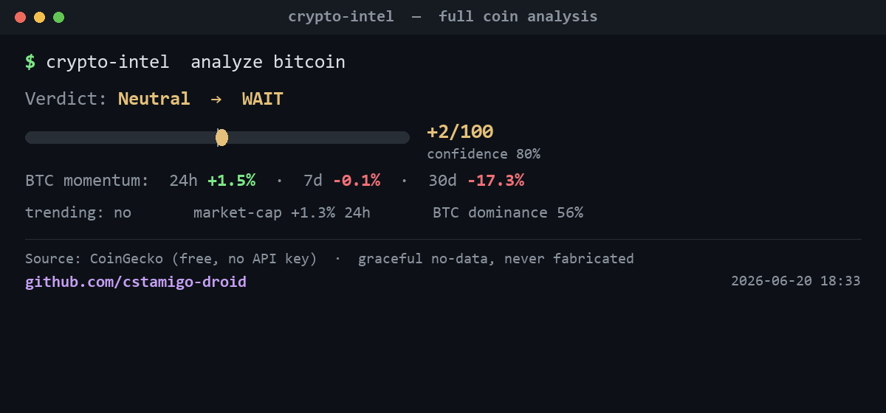

# crypto-intel-mcp

[](LICENSE) [](https://www.python.org) [](https://modelcontextprotocol.io)




**Crypto market intelligence for any LLM, over the [Model Context Protocol](https://modelcontextprotocol.io).**

Gives any MCP client (Claude Desktop, Claude Code, agents) clean tools for crypto
price, momentum, and what's trending — and blends them into a single scored
verdict. Runs entirely on **CoinGecko's free public API (no key)**, fails
gracefully (a missing source returns *"no data"*, never a fabricated value), and
outputs Markdown by default or JSON on demand.

```
# Crypto Intelligence — BTC

**Signal:** Lean positive  `[........|##......]` +22/100  · confidence 80%

Building momentum → LEAN LONG. BTC momentum: 24h +1.9% · 7d +4.4% · 30d -17.0%.
- In CoinGecko trending (elevated attention).
- Total crypto market cap +1.8% 24h, BTC dominance 57%.
```

---

## Tools

| Tool | What it does | Source | Status |
|------|--------------|--------|:------:|
| `crypto_analyze` | **Hero tool.** Blends momentum + trending + market tide into one scored verdict (RISK-ON → AVOID). | composite | ✅ |
| `crypto_get_quote` | Live price, 24h change, market-cap rank, volume, distance from ATH. | CoinGecko | ✅ |
| `crypto_momentum` | Multi-timeframe momentum (24h/7d/30d) scored into one directional signal. | CoinGecko | ✅ |
| `crypto_trending` | The coins the market is searching for most right now. | CoinGecko | ✅ |

Every tool returns **Markdown** (human-readable, default) or **JSON**
(`response_format="json"`) for programmatic use.

---

## Live demo output (2026-06-15)

```
crypto_get_quote bitcoin:
  BTC $66,504.00  +3.4% 24h  · rank #1  · -47% from ATH

crypto_momentum bitcoin:
  Lean positive  [........|##......] +21/100  · confidence 80%
  BTC momentum: 24h +3.4% · 7d +4.9% · 30d -14.8%

crypto_trending:
  ZEC, PENGU, SIREN, TAO, NEAR, BTC, HYPE, GRAM, SUI, H

crypto_analyze bitcoin:
  Lean positive  [........|###.....] +35/100  · confidence 80%
  Building momentum → LEAN LONG. In CoinGecko trending (elevated attention).
  Total crypto market cap +3.6% 24h, BTC dominance 57%.
```

All values are live from CoinGecko's free public API — no key, no fabrication.

---

## Quick start

```bash
git clone https://github.com/cstamigo-droid/crypto-intel-mcp crypto-intel-mcp
cd crypto-intel-mcp
python -m venv .venv && .venv\Scripts\activate     # Windows
pip install -r requirements.txt

python -m crypto_intel_mcp     # starts the MCP server over stdio (no .env needed)
```

**Smoke test** (hits the live CoinGecko API and prints each signal):

```bash
python tests/test_smoke.py bitcoin
```

---

## Use it in Claude Desktop

Add this to `claude_desktop_config.json`
(`%APPDATA%\Claude\` on Windows, `~/Library/Application Support/Claude/` on macOS),
then restart Claude Desktop:

```json
{
  "mcpServers": {
    "crypto-intel-mcp": {
      "command": "python",
      "args": ["-m", "crypto_intel_mcp"],
      "cwd": "C:/path/to/crypto-intel-mcp"
    }
  }
}
```

---

## Why it's built this way

- **Uniform result contract.** Every source returns the same `Result` shape, so
  an LLM can reason across tools instead of parsing N formats.
- **Graceful degradation.** A source with no data returns *"no data"*, not a fake
  value. Missing data never invents an answer.
- **Resilient + cached.** A short per-source TTL cache avoids hammering
  rate-limited endpoints when an agent calls several tools in one turn.

---

## Disclaimer

For research and educational use only. Data comes from third-party sources and
may be delayed or incomplete.

## License

MIT
